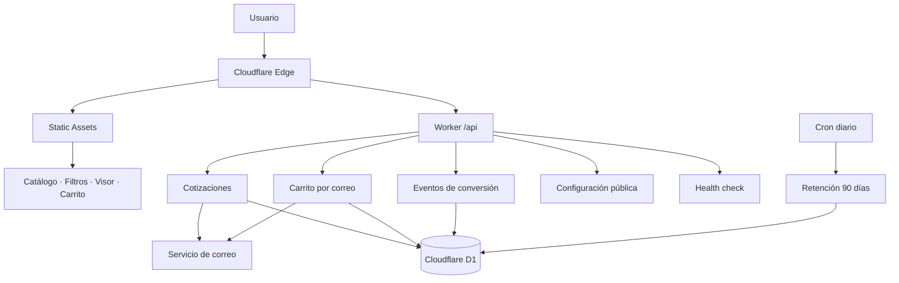

# LM Dotaciones

**Tipo:** Catálogo B2B, carrito y captación de cotizaciones  
**Demo:** https://lmdotaciones.com

## Problema

Convertir un catálogo industrial en un canal comercial digital capaz de presentar productos, capturar solicitudes estructuradas y medir el funnel sin añadir infraestructura innecesaria para el tamaño del negocio.

## Solución

Construí una aplicación B2B sobre Cloudflare Workers, Static Assets y D1. El frontend sirve catálogo, filtros, visor y carrito; el Worker centraliza validación, persistencia, protección antispam, integración de correo y analítica de conversión.

## Stack

- JavaScript / frontend web
- Cloudflare Workers
- Cloudflare Static Assets
- Cloudflare D1 / SQLite
- Wrangler
- Cloudflare Turnstile
- Integración de correo vía API

## Arquitectura

## Componentes técnicos

- Catálogo, filtros y navegación por categorías.
- Visor de producto y carrito.
- Formulario general de cotización.
- Cotización por carrito con múltiples productos.
- Persistencia de solicitudes e items en D1.
- Códigos de seguimiento generados en backend.
- Protección Turnstile + honeypot.
- Validación de correo, teléfono, campos y cantidades.
- Queries parametrizadas a D1.
- Allowlist de eventos de conversión.
- Analítica propia de funnel y retención automática de 90 días.
- Endpoint de salud para operación.
- Integración externa para confirmaciones por correo.
- Esquema SQL y migraciones versionadas.

## Endpoints principales

- `POST /api/cotizaciones`
- `POST /api/carrito-correo`
- `POST /api/eventos`
- `GET /api/configuracion`
- `GET /api/salud`

## Calidad automatizada

El repositorio privado tiene un pipeline de GitHub Actions que valida cada cambio con:

- chequeo preventivo de secretos y archivos de entorno;
- auditoría de dependencias de runtime;
- checks de sintaxis;
- **8 pruebas automáticas** con `node:test` sobre rutas, configuración, health, validaciones, allowlist de eventos y Static Assets;
- dry build del Worker con Wrangler;
- actualizaciones de dependencias mediante Dependabot, sujetas al mismo CI antes de integrarse.

## Decisiones relevantes

- Un único Worker mantiene baja la complejidad operativa.
- Static Assets y el edge de Cloudflare sirven el frontend sin backend dedicado.
- La solicitud se persiste antes de intentar el envío de correo, evitando perder el lead si falla la integración externa.
- La analítica acepta únicamente eventos definidos por el backend.
- La configuración de producción permanece fuera del showcase público.

## Qué demuestra

Este proyecto evidencia un flujo completo **frontend → edge backend → validación → base de datos → integración externa → analítica**, aplicado a un negocio B2B real y con pruebas/CI automatizados.

> El repositorio de producción se mantiene privado porque contiene configuración específica del despliegue. Este caso de estudio expone únicamente arquitectura y funcionalidades no sensibles.
