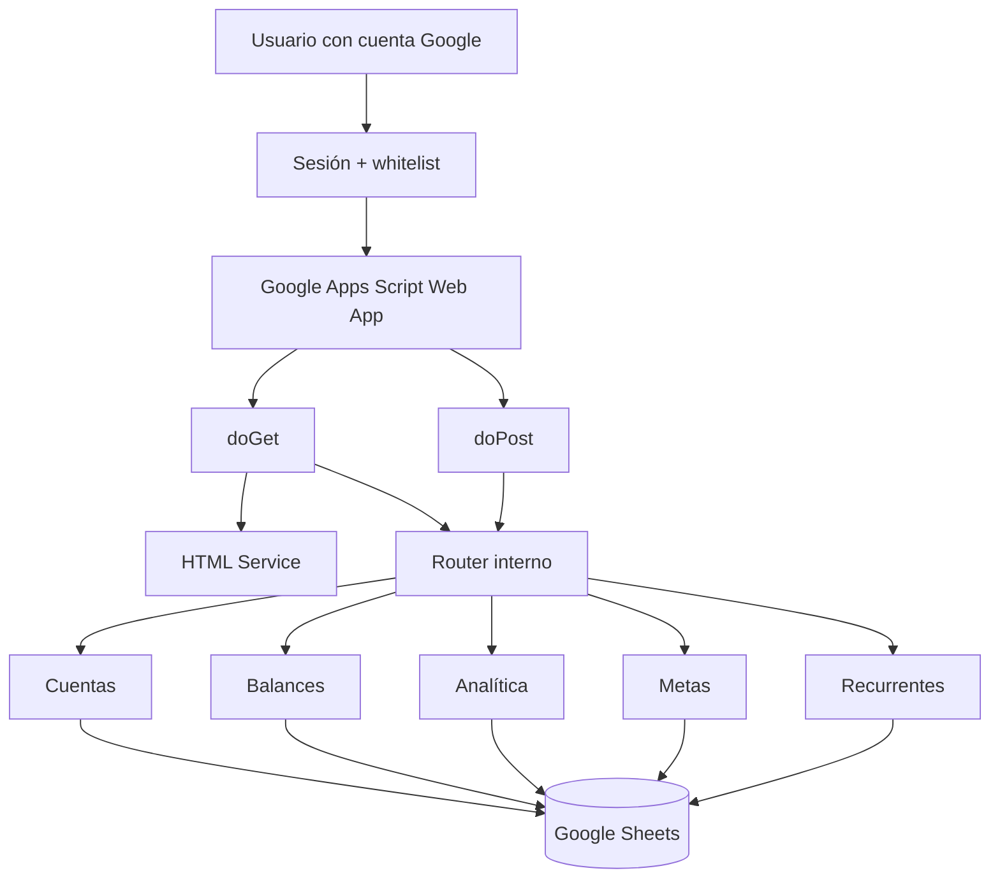

# Tambit

**Tipo:** Aplicación interna de gestión financiera y automatización  
**Stack principal:** Google Apps Script · JavaScript · HTML Service · Google Sheets

## Problema

Convertir procesos financieros apoyados en hojas de cálculo en una experiencia más estructurada, con control de acceso, módulos separados y reglas de negocio reutilizables.

## Solución

Construí una aplicación web interna sobre Google Apps Script. El mismo deployment resuelve interfaz, routing y backend, mientras la lógica se organiza por servicios de dominio y Google Sheets funciona como capa de persistencia para el volumen original del producto.

## Arquitectura

## Funcionalidades técnicas

- autenticación mediante cuenta de Google;
- whitelist adicional de usuarios activos;
- render de vistas con HTML Service;
- routing único para UI y API;
- servicios separados por dominio;
- persistencia en Google Sheets;
- cuentas y balances;
- analítica;
- metas;
- pagos recurrentes y suscripciones;
- estados activo, pausado y cancelado;
- próxima fecha de pago;
- asociación de movimientos a cuentas;
- validación de propiedad de registros por usuario.

## Decisiones técnicas

- Apps Script reduce infraestructura para una herramienta interna integrada al ecosistema Google.
- Separar servicios por dominio evita concentrar toda la lógica en el router principal.
- Sheets es suficiente para el alcance original, pero una evolución con mayor concurrencia debería desacoplar persistencia y migrar dominios críticos a una base dedicada.
- La sesión de Google se complementa con una whitelist operativa en lugar de depender únicamente del login.

## Seguridad y límites

El repositorio principal se mantiene privado porque contiene configuración específica del entorno.

Antes de una versión pública se debe:

- externalizar el identificador del Spreadsheet mediante `PropertiesService`;
- revisar permisos del deployment y scopes de OAuth;
- desactivar debug de producción;
- revisar la política de embedding de las vistas;
- eliminar cualquier configuración específica del entorno.

## Qué demuestra

Tambit muestra experiencia construyendo herramientas internas y automatizaciones de negocio más allá de un frontend tradicional: routing, autorización, persistencia, servicios, reglas financieras y diseño de una arquitectura proporcional al problema.

> El código de producción permanece privado. Este caso de estudio expone únicamente arquitectura y decisiones técnicas no sensibles.
