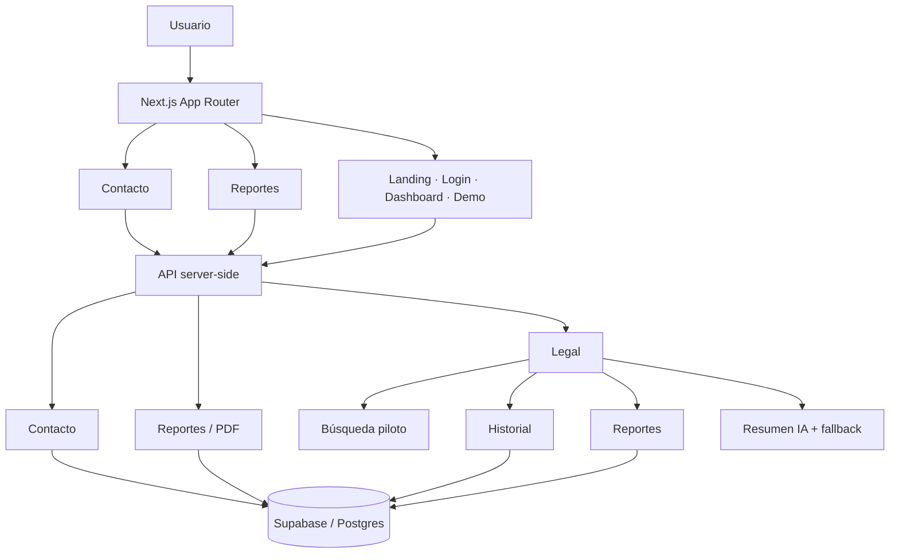

# Verixia

**Tipo:** SaaS B2B legaltech  
**Demo:** https://www.verixia.app

## Problema

Construir una base de producto legaltech que conectara experiencia web, gestión de casos, reportes y una capa de interpretación asistida por IA sin mezclar la interfaz con proveedores o credenciales sensibles.

## Solución

Desarrollé una aplicación full stack con Next.js App Router y TypeScript, persistencia en Supabase, APIs server-side, generación de reportes/PDF y una capa de resumen IA con fallback cuando el proveedor externo no está disponible.

La búsqueda jurídica actual funciona como flujo **piloto/demostrativo** para validar contratos API, UX y reportes. No se presenta como un motor productivo de consulta de antecedentes.

## Stack

- Next.js 16 / React 19
- TypeScript
- Tailwind CSS 4
- Supabase / Postgres
- Route Handlers / REST-like APIs
- Integración de IA con fallback
- Vercel

## Arquitectura

## Componentes técnicos

- Landing pública y flujo de producto.
- Login y base de dashboard.
- Formulario de contacto con endpoint server-side.
- Preview y generación de reportes PDF.
- Endpoints para búsqueda piloto, historial y reportes.
- Resumen IA sobre datos estructurados, con fallback determinista.
- Clientes Supabase separados para browser y server/admin.
- Migraciones de base de datos versionadas.
- Documentación de despliegue, incidentes, changelog y releases.

## Calidad automatizada

El repositorio privado ejecuta un pipeline de GitHub Actions antes de integrar cambios:

- chequeo preventivo de secretos y archivos de entorno;
- `tsc --noEmit` para validar TypeScript;
- ESLint;
- prueba automática de confidencialidad de reportes;
- build de producción;
- actualizaciones de dependencias gestionadas con Dependabot y validadas por el mismo pipeline.

## Decisiones relevantes

- Las API keys y service-role keys permanecen server-side.
- La IA interpreta información entregada por el sistema; no debe inventar hechos.
- El motor de búsqueda está desacoplado de la experiencia de reportes para poder sustituir el mock por proveedores/fuentes verificables.
- El repositorio incluye documentación operativa, no solo código de interfaz.

## Qué demuestra

Este proyecto evidencia trabajo **full stack de producto**: frontend, APIs, datos, migraciones, integración de IA, generación de documentos, despliegue, calidad automatizada y operación.

> El repositorio principal se mantiene privado. Este caso de estudio expone únicamente arquitectura y decisiones técnicas no sensibles.
